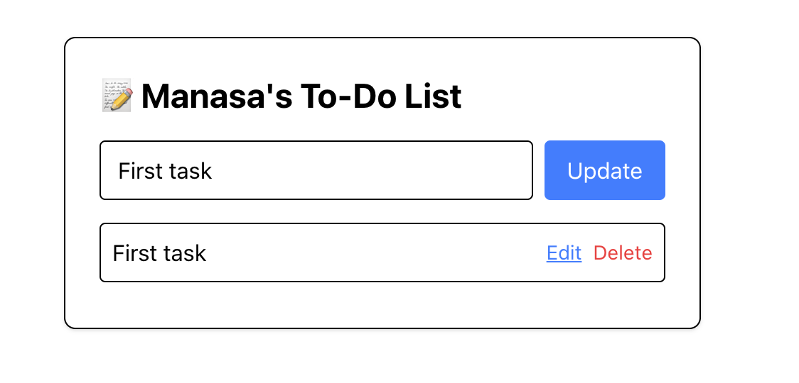

# 🚀 To-Do List App

### Description

A simple **To-Do List** application built with **Next.js**, **React**, and **Tailwind CSS**. This app allows users to create, read, update, and delete tasks efficiently, offering a clean and intuitive user interface.

### 🛠️ Features

- **Add Tasks**: Users can add tasks with titles and descriptions.
- **Edit Tasks**: Users can update existing tasks.
- **Delete Tasks**: Users can remove tasks from the list.
- **Responsive Design**: The app looks great on both desktop and mobile, thanks to **Tailwind CSS**.
- **Dark/Light Mode Support**: Automatically adjusts to system theme (optional).
- **Simple & User-Friendly Interface**: A minimal and intuitive UI for easy use.

---

### 📦 Getting Started

To get a copy of the app up and running on your local machine, follow these steps.

#### Prerequisites

Before running the app, you will need to install the following tools:

- **Node.js** (v16 or higher recommended)
- **npm** (or **yarn**) for managing dependencies
- **Git** for cloning the repository

#### Installation

1. **Clone the repository**:

   ```bash
   git clone https://github.com/manasa9595/todo-app.git
   ```

2. **Navigate to the project folder**:

   ```bash
   cd todo-app
   ```

3. **Install the necessary dependencies**:

   Run the following command to install all required packages for the project:

   ```bash
   npm install
   ```

---

### ⚡ Running the App Locally

After successfully installing the dependencies, you can run the app locally by following these steps:

1. **Start the development server**:

   ```bash
   npm run dev
   ```

2. Once the server is running, open your browser and navigate to:

   [http://localhost:3000](http://localhost:3000)

   The app should now be live on your local machine!

---

### 🧑‍💻 Tech Stack

This app is built using the following technologies:

- **Next.js** – React framework for building server-rendered apps with features like file-system routing and API routes.
- **React** – JavaScript library for building user interfaces.
- **Tailwind CSS** – Utility-first CSS framework for styling.
- **Node.js** – JavaScript runtime environment for server-side code.
- **ESLint** – Linting tool for maintaining code quality.

---

### 🎨 Customization

- **Styling**: The app uses Tailwind CSS for styling, which can be easily customized by modifying the classes in the component files (e.g., `page.jsx`).
- **Functionality**: The logic for handling tasks is located in the components.

---

### 👨‍💻 Author

- **Manasa Natukula** – [GitHub Profile](https://github.com/manasa9595)
- **Project Repository** – [GitHub](https://github.com/manasa9595/todo-app)

---

### 🏗️ Future Enhancements

- **User Authentication**: Add user login functionality.
- **Cloud Storage**: Save tasks to the cloud using a database or API.
- **Drag-and-Drop**: Implement drag-and-drop task reordering.
- **Task Categories**: Allow users to categorize tasks (e.g., "Work", "Personal").

---

### 📸 Screenshots



---

### 💬 Support

If you encounter any issues, feel free to **open an issue** in the repository or contact the author directly.

---

**Enjoy using the To-Do List App!**
